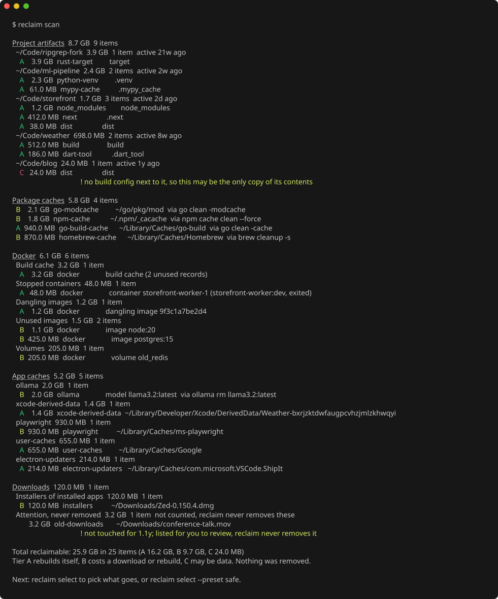
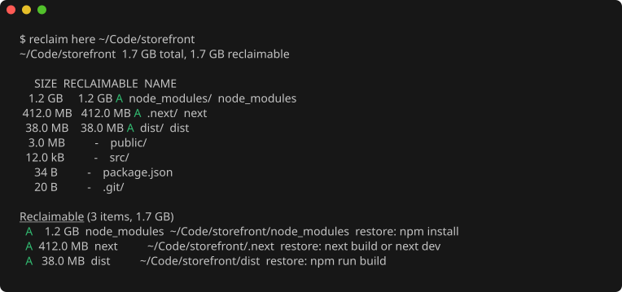
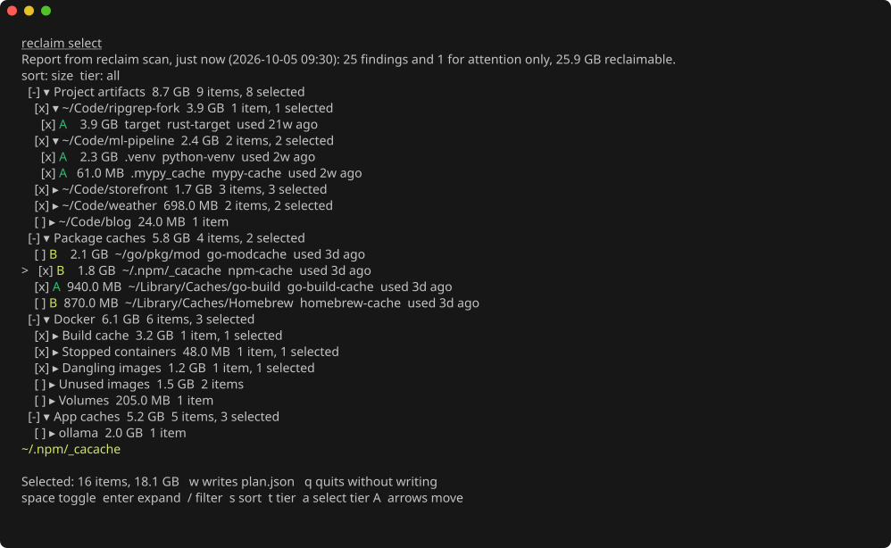

# reclaim

`reclaim` finds the disk space a developer machine can get back: build artifacts, dependency folders, package manager caches, Docker leftovers, app caches and forgotten downloads.
It shows everything with its size and says how each item comes back, and it removes only what you pick and confirm.



Status: phases 1 to 3 are complete.
`scan`, `here`, `select` and `apply` work on macOS and Linux, with table, JSON and Markdown output, an interactive checklist, a config file, shell completion, release binaries and a Homebrew formula.
Windows is not supported.
[docs/DESIGN.md](docs/DESIGN.md) is the specification.

## Install

With Homebrew on macOS or Linux:

```
brew install mandloideep/tap/reclaim
```

The formula installs shell completions for bash, zsh and fish as well.

From a release: download the archive for your system from the [releases page](https://github.com/mandloideep/reclaim/releases), check it against `checksums.txt`, and put `reclaim` on your `PATH`.
Archives exist for macOS and Linux on arm64 and amd64.

With Go 1.25 or newer:

```
go install github.com/mandloideep/reclaim/cmd/reclaim@latest
```

`reclaim version` prints the installed version.

## Quick start

```
reclaim scan                    # report what can be reclaimed; changes nothing
reclaim select                  # tick findings in a checklist; writes plan.json
reclaim apply plan.json         # shows the plan, asks you to type yes, then removes it
```

Prefer no screen at all?
`reclaim select --preset safe` writes a plan with every tier A finding, and `reclaim apply plan.json --yes` runs it without asking.

To see what fills the folder you are in:

```
reclaim here
```

## Tiers

Every finding has a tier that says what removing it costs.

- Tier A rebuilds itself on the next build or install: `node_modules`, `.venv`, Rust `target`, `.next`, Go build caches, dangling Docker images, Xcode DerivedData, app caches.
These are selected for you in the checklist.
- Tier B can be downloaded or rebuilt again, but that costs time or bandwidth: package manager stores such as the npm cache or the Go module cache, Ollama models, Playwright browsers, unused Docker images and volumes, installers of apps you already installed.
They are never preselected.
- Tier C may be data that cannot be restored: a `dist` folder with no build config next to it, a Docker volume attached to a stopped container, an archive in Downloads next to its extracted copy, a Codex worktree with uncommitted changes.
They come with a warning, a preset never selects them, a group toggle skips them, and you tick each one yourself.

Large files in Downloads that nobody touched for 90 days are listed under "Attention, never removed".
They have no tier letter, are never counted as reclaimable and cannot be selected: reclaim shows them so you can decide.

## Safety

- Only `apply` removes anything, only what the plan lists, and only after you type `yes` or pass `--yes`.
`scan`, `here` and `select` never change your files.
- Right before each removal, `apply` checks the target again: it must still exist, be the same kind of thing the scan found, lie inside a folder the scan covered, and contain no symbolic link in its path.
It never removes a project root, a `.git` folder, a folder that holds a project manifest, your home folder, protected folders such as `~/Documents`, or anything shorter than four path components.
- It never follows symbolic links and never crosses into another file system.
- Running Docker containers, their images and their volumes are never offered, and Docker removals never force.
- Package caches are cleaned with the tool's own command when the tool reported where its cache is, and apply asks the tool again first.
Only commands from a fixed list can run, so an edited plan cannot run anything else.
- reclaim never runs with elevated rights.
Anything that needs `sudo` is printed as a command for you to run.
- A plan whose scan is more than 24 hours old is refused unless you pass `--stale-ok`.
- Every `apply` run writes a log of what it did and how much it freed.

## Commands

Every command accepts `--config path` to read another config file and `--verbose` for debug logs.

### scan

```
reclaim scan [path...]
```

Reports everything reclaimable, grouped by category and then by project, Docker object kind or scanner, largest first.
With no path it walks the roots from the config file, or `~/Code`, `~/Developer`, `~/Projects`, `~/src`, `~/work` and `~/Downloads`, whichever exist, and checks package caches, Docker, app caches and Downloads.
With paths it looks only for project artifacts under them.

- `--json` prints the full report as JSON, `--md` prints a Markdown summary for an issue or a document.
- `--min-size 50MB` hides smaller findings; the default is 10 MB and `0` shows everything.
- `--tier A,B` shows only those tiers.
- `--category docker,node` runs only those categories, ecosystems or scanners; `reclaim scanners` lists them.
- `--stale 90d` keeps only project findings of projects without activity for that long.
- `--depth 2` limits how deep the project walk goes below each root.
- `--all` with paths also checks package caches, Docker, app caches and Downloads.
- `--docker-label key=value` limits Docker findings to objects with that label.
- `--out report.json` also saves the report for `select`.

Every scan also saves its report where `select` finds it.

### here

```
reclaim here [path]
```

Shows what takes space in a folder, like `du` one level deep, marks the entries a scanner recognizes with their tier, and lists every reclaimable item below the folder with its full path.



- `--depth 2` shows more levels of the breakdown.
- `--json`, `--md` and `--out report.json` work as for `scan`, so `reclaim here` followed by `reclaim select` cleans up just this folder.

### select

```
reclaim select
```

Reads the last report, or the one given with `--report report.json`, and writes a plan.
In a terminal it opens a checklist: categories, then projects or groups, then findings, each with its size and how many items are selected.



Keys: space toggles, enter or the arrows open and close groups, `/` filters by name, path, scanner or project, `s` changes the sort, `t` cycles the tier filter, `a` selects every visible tier A finding, `w` writes the plan and `q` quits without writing.

- `--preset safe` selects every tier A finding without the checklist, `--preset aggressive` adds tier B.
- `--out plan.json` names the plan file.
- When standard input or output is not a terminal, `select` prints a numbered list and reads numbers such as `1,4-9,12`; tier C items must be listed one by one.

The plan is a JSON file you can read and edit before applying it.

### apply

```
reclaim apply plan.json
```

Prints every action with its size, asks you to type `yes`, then carries the actions out in order and prints the space freed and the log path.

- `--yes` skips the question, for scripts.
- `--keep-going` continues after a failed action instead of stopping.
- `--stale-ok` accepts a plan whose scan is more than 24 hours old.
- `--log apply.log` appends the log to that file instead of a new one in the reclaim cache folder.

### scanners and version

`reclaim scanners` lists every scanner with its category, ecosystem, what it looks for and whether the config file disables it.
`reclaim version` prints the version, the Go version and the platform.

## Config file

reclaim reads its settings from the first of these that applies:

1. the file named by `--config`, which must exist;
2. `$XDG_CONFIG_HOME/reclaim/config.toml`, when `XDG_CONFIG_HOME` is an absolute path;
3. `~/.config/reclaim/config.toml`, on macOS too.

A missing default file means the built in defaults.
Every key is optional, flags override the file, and an unknown key is an error that names it.

```toml
roots = ["~/Code", "~/Downloads"]   # replaces the default scan roots
exclude = ["~/Code/archive"]        # never walked, never offered
min_size = "20MB"                   # default for --min-size
stale = "60d"                       # default for --stale

[scanners]
disable = ["ollama"]                # names, categories or ecosystems, as in reclaim scanners
```

## Shell completion

Completion offers commands, flags and their values: tiers for `--tier`, categories, ecosystems and scanners for `--category`, presets for `--preset`, TOML files for `--config`, JSON files for reports and plans, and folders for `scan` and `here`.
The Homebrew formula sets it up for you.
Otherwise load it from the binary:

zsh, with `compinit` already in your `~/.zshrc`:

```
reclaim completion zsh > "${fpath[1]}/_reclaim"
```

bash, with the bash-completion package installed:

```
reclaim completion bash > "$(brew --prefix)/etc/bash_completion.d/reclaim"   # macOS with Homebrew
reclaim completion bash | sudo tee /etc/bash_completion.d/reclaim >/dev/null  # Linux
```

fish:

```
reclaim completion fish > ~/.config/fish/completions/reclaim.fish
```

Open a new shell afterwards.
`reclaim completion <shell> --help` shows more options, such as loading it for the current session only.

## Adding a scanner

A scanner is a Go type with a name, a category, an ecosystem, a one line description and a `Scan` method:

```go
type Scanner interface {
    Name() string
    Category() finding.Category
    Ecosystem() string
    Description() string
    Scan(ctx context.Context, env scan.Env) ([]finding.Finding, error)
}
```

`Scan` must not change anything and must stop when `ctx` is canceled.
Everything it needs, such as the home folder, the size walker, a runner for asking tools where their caches are and the Docker client, comes from `scan.Env`, so tests can pass fakes.
Each finding says what `apply` does with it, its tier, how to get it back and, for tier C, a warning.

Scanners live in family packages under `internal/scanners`: `projects` for artifact folders inside projects, `caches` for package managers, `docker`, `appcache` and `downloads`.
A new project artifact is usually one more entry in the rules of `internal/scanners/projects/rules.go`, and a new package cache one more entry in `internal/scanners/caches/specs.go`.
A scanner of a new kind is added to the explicit list in `internal/scanners/all.go`.

Every scanner needs tests over a fixture tree in a temp directory, and anything a new scanner lets `apply` remove needs a test that proves it removes only that target.
Removal commands must be added to the allowlist in `internal/plan/commands.go`.
Read [docs/DESIGN.md](docs/DESIGN.md) and [CLAUDE.md](CLAUDE.md) before you start.

## Development

```
go test -race ./...
golangci-lint run
```

The screenshots above are rendered from a fixture machine, never from a real one; `scripts/screenshots.sh` regenerates them.
[docs/RELEASING.md](docs/RELEASING.md) explains how releases are cut.

## License

MIT, see [LICENSE](LICENSE).
